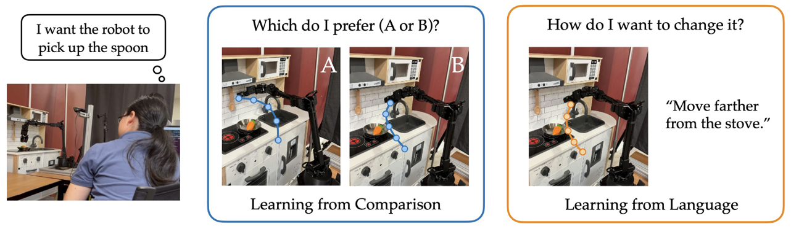

# Trajectory Improvement and Reward Learning from Comparative Language Feedback (CoRL 2024)

<p align="center">

</p>

**Authors**: [Zhaojing Yang](https://yang-zj1026.github.io), [Miru Jun](https://github.com/lemonlemonde), [Jeremy Tien](https://www.linkedin.com/in/jeremy-tien), [Stuart Russell](https://www.cs.berkeley.edu/~russell/), [Anca Dragan](https://people.eecs.berkeley.edu/~anca/), [Erdem Bıyık](https://ebiyik.github.io)

**Website**: https://liralab.usc.edu/comparative-language-feedback

**Paper**: https://arxiv.org/abs/2410.06401


<!-- ## Dependency
- python 3.8
- transformers
- torch -->

## Installation
```
# create conda environment
conda create -n lang python=3.8
conda activate lang

# install dependencies
pip install -r requirements.txt

pip install -e .
```

<!-- ## Data Preprocessing
```
python -m feature_learning.bert_preprocessing --id-mapping \
--data-dir=path_to_data_dir/train
```
Generate Mapping from Trajectory Comparisons to Language Descriptions. 
This should be run for both `train` and `val` folders. 

It will generate the index mapping from trajectory comparisons to language descriptions, 
and BERT embeddings for the language descriptions.  -->

## Download Data
Please download the preprocessed data from [here](https://drive.google.com/drive/folders/1655555555555555555555555555555555555555?usp=sharing) and put it in the `data` folder. If you want to collect your own data, please follow the instructions in [this](https://github.com/jeremy29tien/robosuite-benchmark) and [this](https://github.com/lemonlemonde/modded_metaworld) repo.

## Feature Learning
We adopt a two-stage training procedure. First, we freeze the language model(T5) and train the trajectory encoder. 
Then we finetune the language model and the trajectory encoder jointly.
```
python -m feature_learning.learn_features --initial-loss-check \
--data-dir=data/robosuite_data --batch-size=1024 \
--use-lang-encoder  --exp-name=xxx --lang-model=t5-base --traj-reg-coeff 1e-2
```

## Reward Learning
```
python -m lang_pref_learning.pref_learning.train_pref_learning --env=robosuite \
--data-dir=data/robosuite_pref_learning \
--model-dir=MODEL_DIR \
--true-reward-dir=lang_pref_learning/pref_learning/true_rewards_rs/0 \
--method=lang \
--traj-encoder=mlp \
--lang-model-name=t5-small \
--seed=42 \
--lr=1e-2 \
--weight-decay=0.1 \
--num-iterations=1 \
--use-softmax \
--use-lang-pref \
--use-other-feedback \
--num-other-feedback=20 \
```


